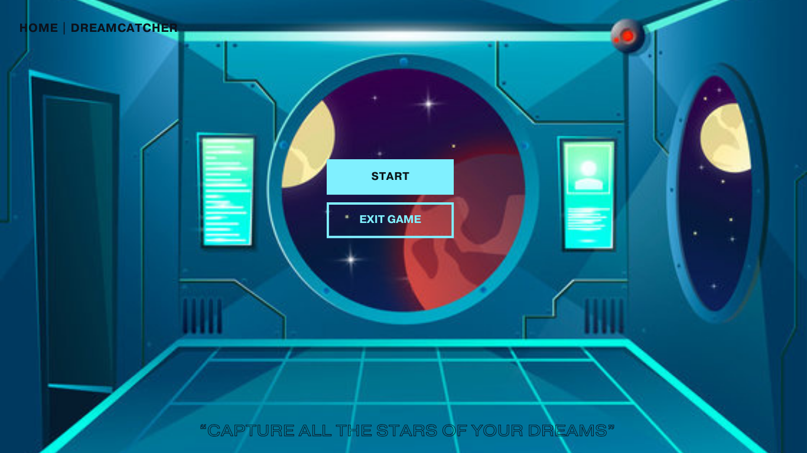
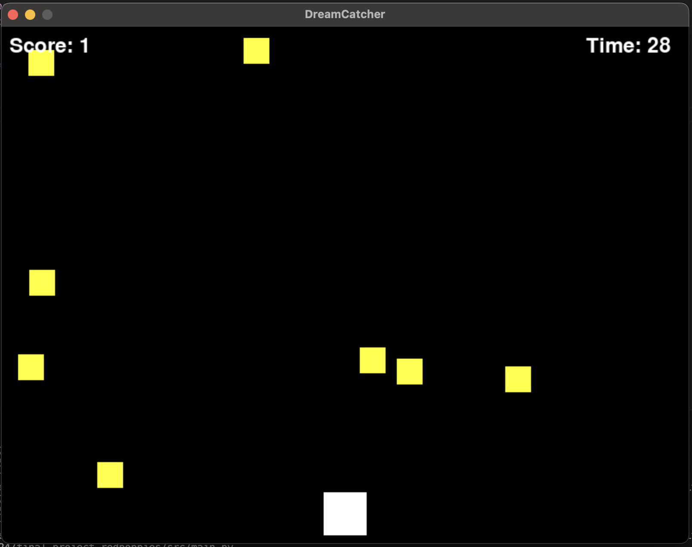

:warning: Everything between << >> needs to be replaced (remove << >> after replacing)

# "Dreamcatcher"
# Course Number: 110

## CS110 Final Project Spring, 2024

## Team Members

Caitlin Bullock and Anya Wester

***

## Project Description

A game where you count the stars in the sky before time runs out 

***    

## GUI Design

### Initial Design

### Final Design

## Program Design

### Features

1. Timer
2. Controlled player
3. Randomly placed stars 
4. Clicker feature
5. Ending statement

### Classes

class Player(pygame.sprite.Sprite):
    def __init__(self, width=800, height=600):
        
            
        """
        Description: Initalizes the player 
        args: 
        -pygame.sprite.spite arguement is being used as a base class for this "Class Player"
        - width and height argument is used to set the parameter for the player movement of the box
        return: None       
    """  
        super().__init__()
        self.WHITE = (255, 255, 255)
        self.image = pygame.Surface((50, 50))
        self.image.fill(self.WHITE)
        self.rect = self.image.get_rect()
        self.rect.centerx = width // 2
        self.rect.bottom = height - 10
        self.speedx = 0

    def update(self, width=800, height=600):
        
        """
        inserts the specficed function to the dictioary with the new added items in this function 
        args: self, width=800, height=600
        return: None
        """
        
        self.speedx = 0
        keys = pygame.key.get_pressed()
        if keys[pygame.K_LEFT]:
            self.speedx = -5
        if keys[pygame.K_RIGHT]:
            self.speedx = 5
        self.rect.x += self.speedx
        if self.rect.right > width:
            self.rect.right = width
        if self.rect.left < 0:
            self.rect.left = 0

class Star(pygame.sprite.Sprite):
    def __init__(self, width=800, height=600):
        
        """
    description: intializes the yellow "stars" (the boxes)
    args: self, and  width=800
    return: None
    """
        super().__init__()
        self.WHITE = (255, 255, 255)
        self.YELLOW = (255, 255, 0)
        self.image = pygame.Surface((30, 30))
        self.image.fill(self.YELLOW)
        self.rect = self.image.get_rect()
        self.rect.x = random.randint(0, width - self.rect.width)
        self.rect.y = random.randint(-100, -40)
        self.speedy = random.randint(3, 7)

    def update(self, width=800, height=600):
        
        """
        descritption: it resets the position of the stars and handles the different speed of the stars 
        args: self, width = 800, and height=600
        return: None
        """
    
        self.rect.y += self.speedy
        if self.rect.top > height:
            self.rect.y = random.randint(-100, -40)
            self.rect.x = random.randint(0, width - self.rect.width)
            self.speedy = random.randint(3, 7)

## ATP

| Step                 |Procedure             |Expected Results                   |
|----------------------|:--------------------:|----------------------------------:|
|  1                   | Start game           |GUI window appears immediately. The timer starts immediately and stars start to fall  |
|  2                   | Click left and right arrow keys| The white box moves left and right|
| 3 | Collect yellow "stars" | The counter in the top left goes up by 1 each time a yellow star touches the white box|
| 4| The timer runs out (after 30 seconds)| Statement appears on the screen saying you won if you collected more than 60 stars. If not, you lose|
|5| Screen closes | When Q key is pressed, the application closes|
